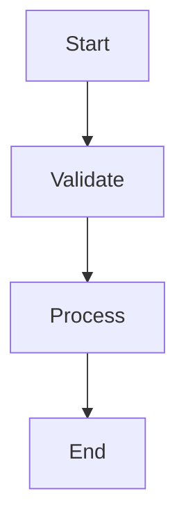

# CodeSleuth

[](LICENSE)
[](CONTRIBUTING.md)
[](CODE_OF_CONDUCT.md)
[](https://github.com/Cod-e-Codes/codesleuth/tree/feat/concurrency-worker-pool)

**CodeSleuth** is a code intelligence CLI tool for analyzing legacy COBOL codebases. It is built with Rust and Go, providing a modular architecture for parsing, analysis, and reporting.

---

## 🚀 Why Use CodeSleuth?

Enterprise COBOL codebases are often large, undocumented, and hard to modernize. CodeSleuth automates structural analysis, dead code detection, and documentation — helping teams audit, refactor, or migrate legacy COBOL more confidently.

---

> **Note:**
> This is the `main` branch. It currently uses a single-threaded Go CLI and separate Rust parser/summarizer binaries. **Unified backend and concurrency are available on the [`feat/concurrency-worker-pool`](https://github.com/Cod-e-Codes/codesleuth/tree/feat/concurrency-worker-pool) branch and will be merged soon.**

> ⚡ **Concurrency/worker pool is in progress and NOT yet on `main`. If you want to help or test, please join the [feature branch](https://github.com/Cod-e-Codes/codesleuth/tree/feat/concurrency-worker-pool) instead of starting a competing fork!**

---

## Features

- **COBOL Parsing:** Rust-based parser for extracting program structure and metadata
- **Analysis & Summarization:** Generates Markdown reports with program structure, data division, procedure logic, call/control flow, and I/O analysis
- **Dead Code Detection:** Identifies unused paragraphs and variables
- **Call & Control Flow Visualization:** Mermaid diagrams for call and control flow
- **Modern CLI:** Go-based command-line interface with verbose/debug options
- **Cross-platform:** Runs on Windows, macOS, and Linux
- **CI/CD Ready:** Automated testing and linting via GitHub Actions

---

## Architecture

- **Rust Parser** (`parser/`): Parses COBOL source files and outputs an intermediate representation (IR) as JSON
- **Rust Summarizer** (`summarizer/`): Consumes IR and generates Markdown reports
- **Go CLI** (`cmd/`): Orchestrates parsing and summarization, providing a user-facing CLI

> **Upcoming:**
> The next release will unify the Rust backend and add concurrent file analysis, as already available on the feature branch.

---

## 🔧 Project Status

This is a **work-in-progress alpha**. The `main` branch is stable for single-file and small-batch COBOL analysis. **Unified backend and concurrency are being actively tested on the feature branch and will be merged after further bug fixes.**

---

## 📄 Example Output

```markdown
# COBOL Program Summary

**Program Name:** PAYROLL01  
**Author:** Jane Doe  
**Working-Storage:** 28 variables  
**Dead Code Detected:** 3 paragraphs

## Control Flow

```



---

## Installation

### Prerequisites

- **Rust** (1.70+): [Install via rustup.rs](https://rustup.rs/)
- **Go** (1.21+): [Download from golang.org](https://golang.org/dl/)
- **Optional:** [Graphviz](https://graphviz.gitlab.io/) for advanced graph rendering

### Build from Source

```bash
# Clone the repository
git clone https://github.com/Cod-e-Codes/codesleuth.git
cd codesleuth

# Build Rust components
cd parser && cargo build --release && cd ..
cd summarizer && cargo build --release && cd ..

# Build Go CLI
cd cmd && go build -o codesleuth && cd ..
```

---

## Usage

```bash
# Analyze a COBOL file or directory (basic usage)
./cmd/codesleuth.exe analyze path/to/your/cobol/files

# Enable verbose output (high-level extra info, logs to stderr)
./cmd/codesleuth.exe analyze --verbose path/to/your/cobol/files

# Enable debug output (detailed trace/internal state, logs to stderr)
./cmd/codesleuth.exe analyze --debug path/to/your/cobol/files

# Analyze a single file
./cmd/codesleuth.exe analyze program.cbl

# Output analysis to a Markdown file
./cmd/codesleuth.exe analyze path/to/your/cobol/files > analysis_report.md

# Output per-file Markdown to a directory
./cmd/codesleuth.exe analyze --output ./summaries path/to/your/cobol/files

# Output JSON instead of Markdown
./cmd/codesleuth.exe analyze --json path/to/your/cobol/files
```

---

## Configuration

CodeSleuth works out-of-the-box. It automatically detects COBOL files (`.cob`, `.cbl`, `.cobol`) and generates analysis reports. No additional configuration is required for standard use cases.

---

## How to Get Involved

- ⭐ Star the repo to show support.
- 🧪 Try the tool on your COBOL codebase and [open an issue](https://github.com/Cod-e-Codes/codesleuth/issues) with feedback.
- 🛠️ For concurrency/back-end improvements, comment on or join the feature branch discussion.
- 📚 See [CONTRIBUTING.md](CONTRIBUTING.md) for coding standards and PR steps.

---

## Known Limitations

- Current release is single-threaded; large codebases may process slowly until concurrency lands in `main`.
- Some COBOL dialects or edge-case constructs may not be fully supported—please report any parsing issues.

---

## Roadmap & Future Enhancements

- **Unified Backend & Concurrency:** Planned for the next release (see feature branch for early access)
- **Configurable Output:** More options for customizing report formats and output destinations.
- **Plugin System:** Extensible architecture for custom analysis or reporting plugins.
- **Improved Error Handling:** More robust diagnostics and user feedback for parsing and analysis errors.
- **Performance Benchmarks:** Publish real-world benchmarks as the tool matures.
- **CI/CD Integration:** Enhanced support for integration with CI/CD pipelines and code quality gates.

## Author & Project Direction

CodeSleuth is actively led and maintained by [your name/GitHub handle]. Major architectural changes (such as the concurrency backend) are planned and documented—see the Roadmap and [feature branch](https://github.com/Cod-e-Codes/codesleuth/tree/feat/concurrency-worker-pool). Community contributions are welcome; please open issues or discussions for significant proposals.

---

## License

This project is released under the MIT License; please credit the original author in any forks or derivative works.

> **Commercial Use:**  
> If your organization is interested in using CodeSleuth in a proprietary, enterprise, or commercial environment and would like dedicated support, licensing, or integration help, please [contact the maintainer](mailto:cod.e.codes.dev@gmail.com) to discuss commercial licensing options.

---

## Links

- [GitHub Repository](https://github.com/Cod-e-Codes/codesleuth)
- [Rust Programming Language](https://www.rust-lang.org/)
- [Go Programming Language](https://golang.org/)

---

*Built for maintainers and developers working with legacy COBOL systems.* 


